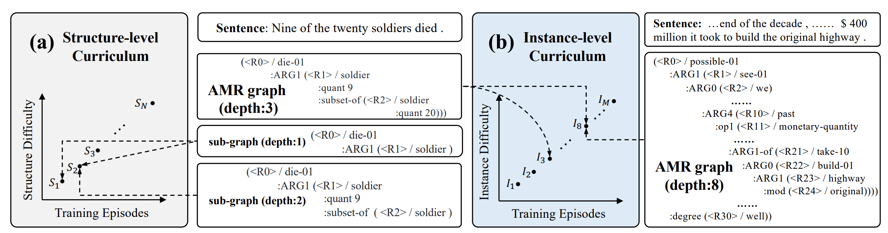

# HCL_Text2AMR
Source code of ACL2022 short paper: [Hierarchical Curriculum Learning for AMR Parsing](https://arxiv.org/abs/2110.07855)

# 🔥 Introduction
The sequence-to-sequence models have become a main stream paradigm for AMR parsing. However, there exists a gap between their flat training objective (i.e., equally treats all output tokens) and the hierarchical AMR structure, which limits the ability of model to learn the inherent hierarchical structure of AMR. To bridge this gap, we propose a Hierarchical Curriculum Learning (HCL) framework with Structure-level (SC) and Instance-level Curricula (IC). SC switches progressively from core to detail AMR semantic elements while IC transits from structure-simple to -complex AMR instances during training.




# 🚀 How to use our code?
## 💾 Enviroment
```
pip install -r requirements.txt
pip install -e .
```
## 🏋🏻‍♂️ Train the model
Modify the data path in `configs/HCL.yaml`. Then run:
```
bash bash/train.sh [gpu id]
```


## 🥷 Evaluation
### inference test data
```
bash bash/predict.sh [gpu_id] [AMR dataset version (e.g., 2)] [checpoint path] 
```

### post processing
use [BLINK](https://github.com/facebookresearch/BLINK) to post process the output of the model
```
bash bash/blinkified.sh [gpu_id] [AMR dataset version]
```

### fine grained evaluation
```
bash bash/fine-eval.sh [AMR dataset version]
```
To have comparable Smatch scores in our paper, you need to use the ORIGIN scripts available at https://github.com/mdtux89/amr-evaluation, which provide results that are around ~0.3 Smatch points lower than those returned by ```bash bash/fine-eval.sh'''

# 🌝 Citation
If you use our code, please cite our paper:
```
@inproceedings{wang-etal-2022-hierarchical,
    title = "Hierarchical Curriculum Learning for {AMR} Parsing",
    author = "Wang, Peiyi  and
      Chen, Liang  and
      Liu, Tianyu  and
      Dai, Damai  and
      Cao, Yunbo  and
      Chang, Baobao  and
      Sui, Zhifang",
    booktitle = "Proceedings of the 60th Annual Meeting of the Association for Computational Linguistics (Volume 2: Short Papers)",
    month = may,
    year = "2022",
    address = "Dublin, Ireland",
    publisher = "Association for Computational Linguistics",
    url = "https://aclanthology.org/2022.acl-short.37",
    pages = "333--339",
    abstract = "Abstract Meaning Representation (AMR) parsing aims to translate sentences to semantic representation with a hierarchical structure, and is recently empowered by pretrained sequence-to-sequence models. However, there exists a gap between their flat training objective (i.e., equally treats all output tokens) and the hierarchical AMR structure, which limits the model generalization. To bridge this gap, we propose a Hierarchical Curriculum Learning (HCL) framework with Structure-level (SC) and Instance-level Curricula (IC). SC switches progressively from core to detail AMR semantic elements while IC transits from structure-simple to -complex AMR instances during training. Through these two warming-up processes, HCL reduces the difficulty of learning complex structures, thus the flat model can better adapt to the AMR hierarchy. Extensive experiments on AMR2.0, AMR3.0, structure-complex and out-of-distribution situations verify the effectiveness of HCL.",
}
```

# 🙏 Acknowledgements
Our code is based on [SPRING](https://github.com/SapienzaNLP/spring). Thanks for their high quality open codebase.  
```
@inproceedings{bevilacqua-etal-2021-one,
    title = {One {SPRING} to Rule Them Both: {S}ymmetric {AMR} Semantic Parsing and Generation without a Complex Pipeline},
    author = {Bevilacqua, Michele and Blloshmi, Rexhina and Navigli, Roberto},
    booktitle = {Proceedings of AAAI},
    year = {2021}
}

```


# Model Checkpoints
- Todo
